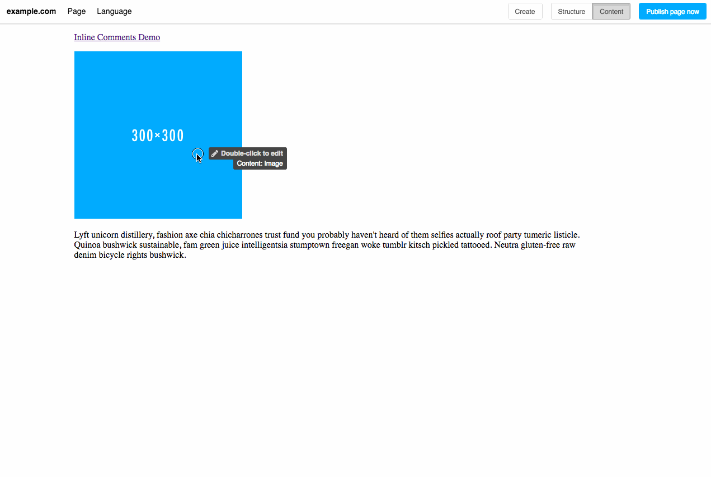

========================
djangocms-inline-comment
========================

|build| |coverage|

**django CMS Inline Comment** is a plugin for `django CMS <http://django-cms.org>`_ that allows you to add comments to the structure board, visible to editors only. You can nest other plugins inside an inline comment, which renders them invisible on a published page.

Supports Django >= 1.8 and django CMS >= 3.3. https://github.com/divio/djangocms-text-ckeditor is a requirement.

(If you are looking for a plugin for public-facing comments, please have a look at https://github.com/Nekmo/djangocms-comments, https://github.com/aldryn/aldryn-disqus, or https://github.com/mishbahr/djangocms-fbcomments.)

Installation
------------

* run ``pip install djangocms-inline-comment``
* add ``'djangocms_text_ckeditor' and 'djangocms_inline_comment'`` to your ``INSTALLED_APPS``
* run ``python manage.py migrate djangocms_inline_comment``

Running Tests
-------------

You can run tests by executing::

    virtualenv env
    source env/bin/activate
    pip install -r requirements-test.txt
    python setup.py test

.. |build| image:: https://travis-ci.org/arteria/djangocms-inline-comment.svg?branch=master
    :target: https://travis-ci.org/arteria/djangocms-inline-comment
.. |coverage| image:: https://coveralls.io/repos/github/arteria/djangocms-inline-comment/badge.svg?branch=master
    :target: https://coveralls.io/github/arteria/djangocms-inline-comment?branch=master

djangocms-inline-comment is free software. If you find it useful and would like to give back, please consider to make a donation using Bitcoin https://blockchain.info/payment_request?address=1AJkbQdcNkrHzxi91mB1kkPxh4t4BJ4hu4 or PayPal https://www.paypal.me/arteriagmbh. Thank you! 
